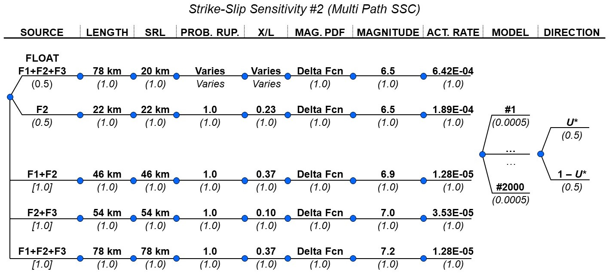
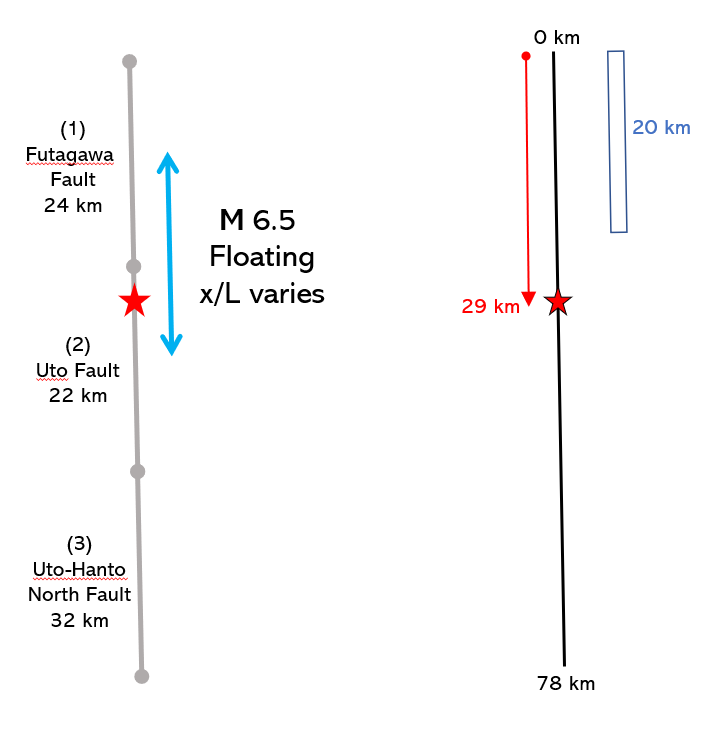

### Sensitivity 2

The logic tree based on the information provided by the IAEA and as-implemented
in the PFDA is shown on Figure \ref{fig:logic_KM2}. 

The floating earthquake was implemented by advancing a fixed 20-km-long rupture 
along the length of the full fault system (i.e., F1+F2+F3, which is 78 km in 
total length) in a fixed increment (Figure \ref{fig:float}). We evaluated 
increments of 0.5-km and 1.0-km and found the hazard results were similar; 
therefore, for simplicity, only the results for the 1.0-km increment are 
presented here. 

The probability of the rupture passing by the site is $P(rup)=\frac{1}{N_{adv}}$ 
(where $N_{adv}$ is the number of 20-km-long advancements that fit entirely in 
the 78-km-long fault system). For each advancement that passes by the site, 
the normalized position along rupture $U_*$is computed and used in the hazard 
calculation. The results are listed in Table \ref{tab:table}. The final 
earthquake rate for each advancement is computed from the rate of the Float 
branch on Figure \ref{fig:logic_KM2}, multiplied by $P(rup)$. 


The mean model results are shown on Figure \ref{fig:mean_model_KM2}.

The source contributions for the mean model are shown on Figure 
\ref{fig:mean_model_srcs}. For completeness, the unweighted hazard curves for 
the epistemic branch (i.e., Float vs. F2) are shown; however, only the combined 
(weighted) branch is included in the total hazard curve. As observed on this
figure, the net activity rates for both epistemic branches (i.e., Float vs. F2) 
are similar because most of the 20-km-long floating ruptures occur on sections 
of the fault that do not pass through the site (Table \ref{tab:table}).

The full model results are shown on Figure \ref{fig:full_model_KM2}.

The source contributions for the mean model are shown on Figure 
\ref{fig:full_model_srcs}. 

A comparison of the mean model and full model results is shown on Figure 
\ref{fig:compare_KM2}.

\newpage
```{r, fig.cap = "Kumamoto Sensitivity 2 logic tree (used with $r=0~km$ instead of $r=0.6~km$). \\label{fig:logic_KM2}", out.width = '100%', fig.align = "center"}

```

```{r, fig.cap = "Kumamoto Sensitivity 2 floating earthquake explanation. \\label{fig:float}", out.width = '50%', fig.align = "center"}

```

\newpage
```{r, message = FALSE}
library(readxl)
library(dplyr)

fp <- "../figures/kumamoto2/strike-slip-case2.xlsx"

df <- read_excel(fp, sheet = "FloatCalcs-1p0", range = cell_cols("E:J")) %>%  
  mutate(x_L = replace(x_L, x_L < 0 , "")) %>% 
   mutate_if(is.numeric, format, digits=4,nsmall = 0)


kable(df, caption="Kumamoto Sensitivity 2 floating earthquake summary. \\label{tab:table}")
```


```{r, fig.cap = "Kumamoto Sensitivity 2 FDM mean model results. \\label{fig:mean_model_KM2}", out.width = '80%', fig.subcap=c('For given site location $U_*$.', 'For complementary site location $1-U_*$.', 'With equal weighting on $U_*$ and $1-U_*$.'), fig.ncol = 1, fig.align = "left"}
include_graphics(c("../../4_plotting/figures/kumamoto_case2/mean_model/epistemic_haz_curves_left.png", "../../4_plotting/figures/kumamoto_case2/mean_model/epistemic_haz_curves_right.png", "../../4_plotting/figures/kumamoto_case2/mean_model/epistemic_haz_curves_folded.png"))
```

   
```{r, fig.cap = "Kumamoto Sensitivity 2 FDM mean model source contribution results. \\label{fig:mean_model_srcs}", out.width = '80%', fig.subcap=c('For given site location $U_*$.', 'For complementary site location $1-U_*$.', 'With equal weighting on $U_*$ and $1-U_*$.'), fig.ncol = 1, fig.align = "left"}
include_graphics(c("../../4_plotting/figures/kumamoto_case2/mean_model/source_contributions_left.png", "../../4_plotting/figures/kumamoto_case2/mean_model/source_contributions_right.png", "../../4_plotting/figures/kumamoto_case2/mean_model/source_contributions_folded.png"))
```

   
```{r, fig.cap = "Kumamoto Sensitivity 2 FDM full model results. \\label{fig:full_model_KM2}", out.width = '80%', fig.subcap=c('For given site location $U_*$.', 'For complementary site location $1-U_*$.', 'With equal weighting on $U_*$ and $1-U_*$.'), fig.ncol = 1, fig.align = "left"}
include_graphics(c("../../4_plotting/figures/kumamoto_case2/full_model/epistemic_haz_curves_left.png", "../../4_plotting/figures/kumamoto_case2/full_model/epistemic_haz_curves_right.png", "../../4_plotting/figures/kumamoto_case2/full_model/epistemic_haz_curves_folded.png"))
```

```{r, fig.cap = "Kumamoto Sensitivity 2 FDM mean model source contribution results. \\label{fig:full_model_srcs}", out.width = '80%', fig.subcap=c('For given site location $U_*$.', 'For complementary site location $1-U_*$.', 'With equal weighting on $U_*$ and $1-U_*$.'), fig.ncol = 1, fig.align = "left"}
include_graphics(c("../../4_plotting/figures/kumamoto_case2/full_model/source_contributions_left.png", "../../4_plotting/figures/kumamoto_case2/full_model/source_contributions_right.png", "../../4_plotting/figures/kumamoto_case2/full_model/source_contributions_folded.png"))
```


   
```{r, fig.cap = "Comparison of FDM mean and full model results for Kumamoto Sensitivity 2. \\label{fig:compare_KM2}", out.width = '80%', fig.subcap=c('For given site location $U_*$.', 'For complementary site location $1-U_*$.', 'With equal weighting on $U_*$ and $1-U_*$.'), fig.ncol = 1, fig.align = "left"}
include_graphics(c("../../4_plotting/figures/kumamoto_case2/epistemic_haz_curves_compare_FDMs_left.png", "../../4_plotting/figures/kumamoto_case2/epistemic_haz_curves_compare_FDMs_right.png", "../../4_plotting/figures/kumamoto_case2/epistemic_haz_curves_compare_FDMs_folded.png"))
```
