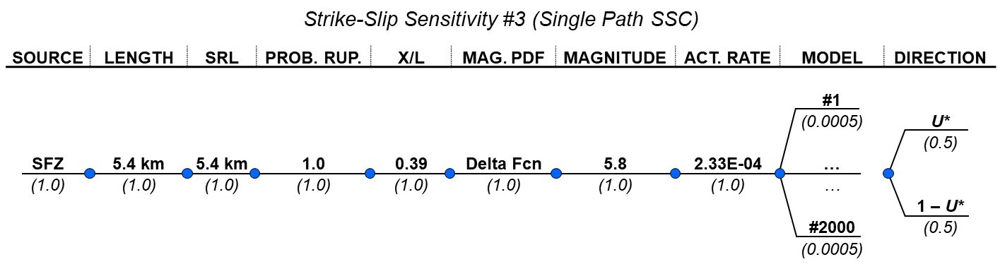

### Sensitivity 3

The logic tree based on the information provided by the IAEA and as-implemented
in the PFDA is shown on Figure \ref{fig:logic_KM3}.

The mean model results are shown on Figure \ref{fig:mean_model_KM3}.

The full model results are shown on Figure \ref{fig:full_model_KM3}.

A comparison of the mean model and full model results is shown on Figure 
\ref{fig:compare_KM3}.


```{r, fig.cap = "Kumamoto Sensitivity 3 logic tree. \\label{fig:logic_KM3}", out.width = '100%', fig.align = "center"}

```


   
```{r, fig.cap = "Kumamoto Sensitivity 3 FDM mean model results. \\label{fig:mean_model_KM3}", out.width = '80%', fig.subcap=c('For given site location $U_*$.', 'For complementary site location $1-U_*$.', 'With equal weighting on $U_*$ and $1-U_*$.'), fig.ncol = 1, fig.align = "left"}
include_graphics(c("../../4_plotting/figures/kumamoto_case3/mean_model/epistemic_haz_curves_left.png", "../../4_plotting/figures/kumamoto_case3/mean_model/epistemic_haz_curves_right.png", "../../4_plotting/figures/kumamoto_case3/mean_model/epistemic_haz_curves_folded.png"))
```


   
```{r, fig.cap = "Kumamoto Sensitivity 3 FDM full model results. \\label{fig:full_model_KM3}", out.width = '80%', fig.subcap=c('For given site location $U_*$.', 'For complementary site location $1-U_*$.', 'With equal weighting on $U_*$ and $1-U_*$.'), fig.ncol = 1, fig.align = "left"}
include_graphics(c("../../4_plotting/figures/kumamoto_case3/full_model/epistemic_haz_curves_left.png", "../../4_plotting/figures/kumamoto_case3/full_model/epistemic_haz_curves_right.png", "../../4_plotting/figures/kumamoto_case3/full_model/epistemic_haz_curves_folded.png"))
```


   
```{r, fig.cap = "Comparison of FDM mean and full model results for Kumamoto Sensitivity 3. \\label{fig:compare_KM3}", out.width = '80%', fig.subcap=c('For given site location $U_*$.', 'For complementary site location $1-U_*$.', 'With equal weighting on $U_*$ and $1-U_*$.'), fig.ncol = 1, fig.align = "left"}
include_graphics(c("../../4_plotting/figures/kumamoto_case3/epistemic_haz_curves_compare_FDMs_left.png", "../../4_plotting/figures/kumamoto_case3/epistemic_haz_curves_compare_FDMs_right.png", "../../4_plotting/figures/kumamoto_case3/epistemic_haz_curves_compare_FDMs_folded.png"))
```


