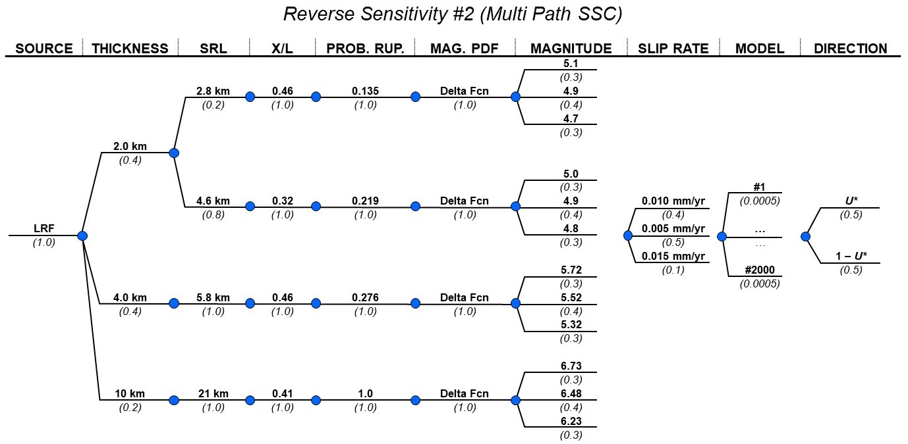

### Extra Effort

The logic tree based on the multi-path base case was instead evaluated for 
on-fault (principal) rupture (i.e., $r=0~km$ instead of $r=0.6~km$). The 
logic tree as-implemented in the PFDA is shown on Figure \ref{fig:logic_LTX}.


The mean model results are shown on Figure \ref{fig:mean_model_LTX}.

The full model results are shown on Figure \ref{fig:full_model_LTX}.

A comparison of the mean model and full model results is shown on Figure 
\ref{fig:compare_LTX}.


```{r, fig.cap = "Le Teil multi-path logic tree (used with $r=0~km$ instead of $r=0.6~km$). \\label{fig:logic_LTX}", out.width = '100%', fig.align = "center"}

```


   
```{r, fig.cap = "Le Teil 'Extra Effort' FDM mean model results. \\label{fig:mean_model_LTX}", out.width = '80%', fig.subcap=c('For given site location $U_*$.', 'For complementary site location $1-U_*$.', 'With equal weighting on $U_*$ and $1-U_*$.'), fig.ncol = 1, fig.align = "left"}
include_graphics(c("../../4_plotting/figures/le_teil_extra/mean_model/epistemic_haz_curves_left.png", "../../4_plotting/figures/le_teil_extra/mean_model/epistemic_haz_curves_right.png", "../../4_plotting/figures/le_teil_extra/mean_model/epistemic_haz_curves_folded.png"))
```


   
```{r, fig.cap = "Le Teil 'Extra Effort' FDM full model results. \\label{fig:full_model_LTX}", out.width = '80%', fig.subcap=c('For given site location $U_*$.', 'For complementary site location $1-U_*$.', 'With equal weighting on $U_*$ and $1-U_*$.'), fig.ncol = 1, fig.align = "left"}
include_graphics(c("../../4_plotting/figures/le_teil_extra/full_model/epistemic_haz_curves_left.png", "../../4_plotting/figures/le_teil_extra/full_model/epistemic_haz_curves_right.png", "../../4_plotting/figures/le_teil_extra/full_model/epistemic_haz_curves_folded.png"))
```


   
```{r, fig.cap = "Comparison of FDM mean and full model results for Le Teil 'Extra Effort'. \\label{fig:compare_LTX}", out.width = '80%', fig.subcap=c('For given site location $U_*$.', 'For complementary site location $1-U_*$.', 'With equal weighting on $U_*$ and $1-U_*$.'), fig.ncol = 1, fig.align = "left"}
include_graphics(c("../../4_plotting/figures/le_teil_extra/epistemic_haz_curves_compare_FDMs_left.png", "../../4_plotting/figures/le_teil_extra/epistemic_haz_curves_compare_FDMs_right.png", "../../4_plotting/figures/le_teil_extra/epistemic_haz_curves_compare_FDMs_folded.png"))
```
