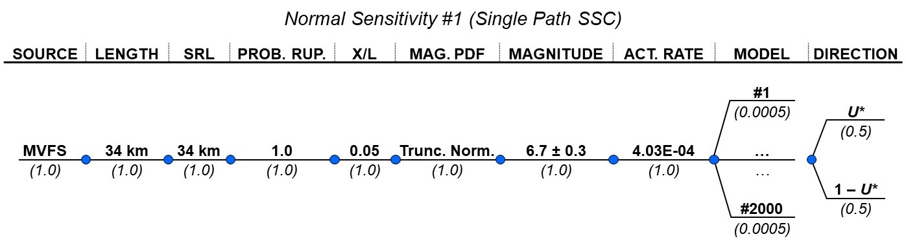

## Norcia (Normal) Case

The only applicable sensitivity case (i.e., for on-fault (principal) faulting) 
is Sensitivity 1. There is no epistemic uncertainty in the seismic source 
characterization for Sensitivity 1.

The logic tree based on the information provided by the IAEA and as-implemented
in the PFDA is shown on Figure \ref{fig:logic_N1}.

The mean model results are shown on Figure \ref{fig:mean_model_N1}.

The full model results are shown on Figure \ref{fig:full_model_N1}.

A comparison of the mean model and full model results is shown on Figure 
\ref{fig:compare_N1}.


```{r, fig.cap = "Norcia Sensitivity 1 logic tree. \\label{fig:logic_N1}", out.width = '100%', fig.align = "center"}

```


   
```{r, fig.cap = "Norcia Sensitivity 1 FDM mean model results. \\label{fig:mean_model_N1}", out.width = '80%', fig.subcap=c('For given site location $U_*$.', 'For complementary site location $1-U_*$.', 'With equal weighting on $U_*$ and $1-U_*$.'), fig.ncol = 1, fig.align = "left"}
include_graphics(c("../../4_plotting/figures/norcia_case1/mean_model/epistemic_haz_curves_left.png", "../../4_plotting/figures/norcia_case1/mean_model/epistemic_haz_curves_right.png", "../../4_plotting/figures/norcia_case1/mean_model/epistemic_haz_curves_folded.png"))
```


   
```{r, fig.cap = "Norcia Sensitivity 1 FDM full model results. \\label{fig:full_model_N1}", out.width = '80%', fig.subcap=c('For given site location $U_*$.', 'For complementary site location $1-U_*$.', 'With equal weighting on $U_*$ and $1-U_*$.'), fig.ncol = 1, fig.align = "left"}
include_graphics(c("../../4_plotting/figures/norcia_case1/full_model/epistemic_haz_curves_left.png", "../../4_plotting/figures/norcia_case1/full_model/epistemic_haz_curves_right.png", "../../4_plotting/figures/norcia_case1/full_model/epistemic_haz_curves_folded.png"))
```


   
```{r, fig.cap = "Comparison of FDM mean and full model results for Norcia Sensitivity 1. \\label{fig:compare_N1}", out.width = '80%', fig.subcap=c('For given site location $U_*$.', 'For complementary site location $1-U_*$.', 'With equal weighting on $U_*$ and $1-U_*$.'), fig.ncol = 1, fig.align = "left"}
include_graphics(c("../../4_plotting/figures/norcia_case1/epistemic_haz_curves_compare_FDMs_left.png", "../../4_plotting/figures/norcia_case1/epistemic_haz_curves_compare_FDMs_right.png", "../../4_plotting/figures/norcia_case1/epistemic_haz_curves_compare_FDMs_folded.png"))
```

